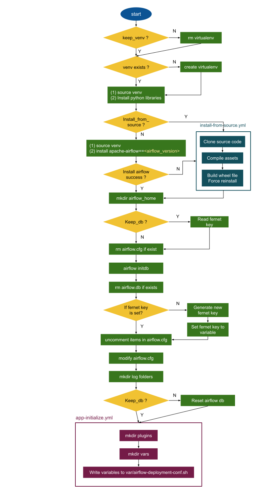

# Airflow Deployment Flow

## Deployment yml Structure
```
airflow-operation
└───airflow
│   └───airflow-vars
│   │   │   airflow-dev.yml
│   │   │   airflow-<env>.yml
│   └───sub-tasks
│   │   │   app-initialize.yml
│   │   │   install-from-source.yml
│   │   airflow-deployment.yml
```
* airflow-vars:<br/>
If using `./deploy.sh -s airflow -e dev ...`, it will use variables in `airflow-dev.yml` to deploy airflow. Add `.yml` file for different environment setting in this folder.
* sub-tasks:<br/>
Define sub tasks and include in `airflow-deployment.yml` will let deployment `.yml` more readable, and easier to be controlled by flag. e.g., `--install-from-source` triggered `install-from-source.yml`
* `airflow-depolyment.yml`:<br/>
Main deployment flow, and the flow chart is in next section.

## Execution flow in `airflow/airflow-deployment.yml`

